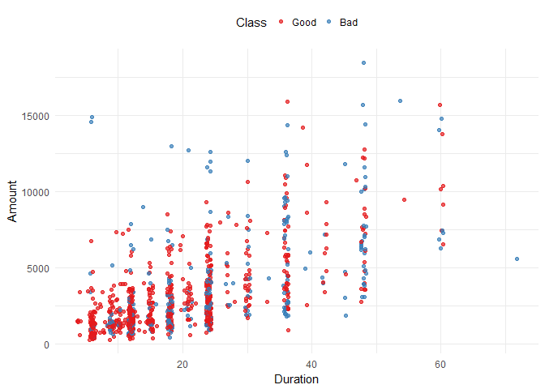
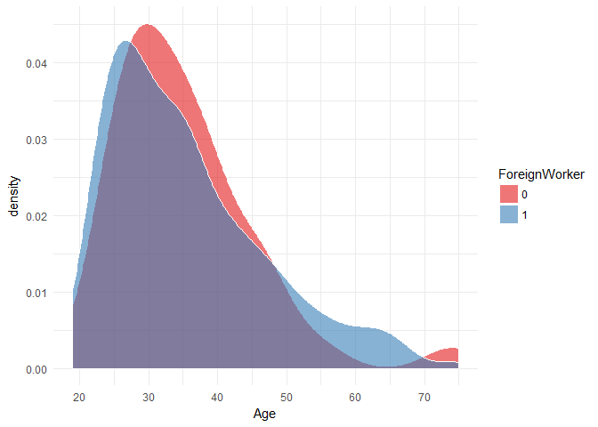

manipulating large data with R
================

Handling large data files with R using **chunked** and **data.table** packages.
-------------------------------------------------------------------------------

Here we are going to explore how can we read manipulate and analyse large data files with R.

##### Getting the data:

Here we'll be using *GermanCredit* dataset from *caret* package. It isn't a very large data but it is good to demonstrate the concepts.

``` r
library(caret)
data("GermanCredit")
write.csv(GermanCredit, "german_credit.csv")
```

Now we have the data file in desk and we want to read it to extract some information from it. We don't always need to read the whole file, we can go well with subset of the data. For example, for machine learning models we can extract a representable sample from the data to build the model without reading the whole file. That is what we're going to do here, we will read samples of data to get the information we need without reading the whole file into memory.

We will use the power of **chunked** package , <https://github.com/edwindj/chunked>, that enables us to navegate the data files in chunks and do some *dplyr* manipulations to the data loading only a part of the data in memory making sure that chunk by chunk is processed. **chunked** is built on top of *LaF* and uses *dplyr* syntax.

We will also explore some trick to load the data in chunks with **data.table**.

###### N.B. we can also use the command line to do all this. <https://mnoorfawi.github.io/Large-Data-Processing-with-Command-Line/>

Let's get down to business....

###### Get a general look at the data

``` r
library(chunked)
library(dplyr)
## Here we don't read the file, we just get something like a pointer to it.
data_chunked <- read_chunkwise('german_credit.csv', 
                              chunk_size = 100)
```

``` r
data_chunked
# Source: chunked text file 'german_credit.csv' [?? x 63]
# 
# # data.frame [6 × 63]
```

Looking at what data\_chunked returns, we get to know the number of columns and it also tells us some information on columns type, for example we have so many integer columns and we have a factor column which is *Class*.

but what if we want to know the number of rows;

``` r
data_chunked %>% 
  summarise(n = n()) %>% # chunked will get the number of rows of each chunk
  as.data.frame() %>% # here we read the data returned from summarise()
  summarise(nrows = sum(n)) # and summarise() the length of each chunk
```

    ##   nrows
    ## 1  1000

We saw the there's a factor variable in the data, so let's look at its levels' frequencies in the data;

``` r
data_chunked %>%
  group_by(Class) %>%
  summarise(freq = n()) %>%
  as.data.frame() %>%
  group_by(Class) %>%
  summarise(freq = sum(freq))
```

    ## # A tibble: 2 × 2
    ##    Class  freq
    ##   <fctr> <int>
    ## 1   Good   700
    ## 2    Bad   300

Fine! let's do some more complicated query... Imagine we want to know the average age per class of single males who are foreign worker and have less than two credits...

``` r
data_chunked %>%
  select(Class, Age, 
         Personal.Male.Single, 
         ForeignWorker, NumberExistingCredits) %>%
  filter(Personal.Male.Single > 0 & 
           ForeignWorker > 0 & 
           NumberExistingCredits < 2) %>%
  group_by(Class) %>%
  summarise(mean_age = mean(Age)) %>%
  collect() %>% 
  group_by(Class) %>%
  summarise(mean_age = mean(mean_age))
```

    ## # A tibble: 2 × 2
    ##    Class mean_age
    ##   <fctr>    <dbl>
    ## 1   Good 36.99990
    ## 2    Bad 36.64614

As you can see, chunked waits till the last moment to read the data. this is amazing when it comes to big data files.

let's do some analysis. Let's plot a box plot between Class and Amount.

``` r
data_chunked %>% 
  select(Class, Amount, Duration) %>%
  collect() %>%
  ggplot(aes(x = Duration, y = Amount, color = Class)) +
    geom_jitter(alpha = 0.7) + 
    scale_color_brewer(palette = 'Set1') +
    theme_minimal() + 
    theme(legend.position = 'top')
```



Now what about the distribution of Age per ForeignWorker

``` r
data_chunked %>% 
  select(Age, ForeignWorker) %>%
  mutate(ForeignWorker = as.factor(ForeignWorker)) %>%
  collect() %>%
  ggplot(aes(x = Age, fill = ForeignWorker)) +
    geom_density(color = 'white', alpha = 0.6) +
    scale_x_continuous(breaks = seq(10, 100, 10)) +
    theme_minimal() + scale_fill_brewer(palette = 'Set1')
```



GREAT! we have done all this without reading the whole data...

We can also read sample of the data for further analysis.

``` r
sampled <- data_chunked %>%
  mutate(rand = runif(100)) %>% ## 100 number of each chunk
  filter(rand < 0.1) %>%
  select(- rand) %>%
  as.data.frame()
dim(sampled)
```

    ## [1] 103  63

We can also use **sqldf** to sample the data.

``` r
library(sqldf)
query <- 'SELECT * FROM file ORDER BY RANDOM() LIMIT 100'
df <- read.csv.sql('german_credit.csv', 
                   sql = query)
```

Now we are going to fetch specific rows from data in chunks with **data.table**. suppose we only need the rows with the Purpose.Education columns is TRUE. so first we get the indices of these rows.

``` r
indices <- data_chunked %>% 
  mutate(n = Purpose.Education > 0) %>%
  select(n) %>% 
  collect()
indices <- indices[, 1]
```

No we can chunk the data with **data.table::fread()**.

``` r
library(data.table)
sequence  <- rle(indices)
index  <- c(0, cumsum(sequence$lengths))[which(sequence$values)] + 1
idx <- data.frame(start = index, 
                   length = sequence$length[which(sequence$values)])
data_fread <- do.call(
  rbind,
  apply(idx, 1, 
              function(x) return(fread(
                "german_credit.csv", nrows = x[2], skip = x[1]))))
dim(data_fread)
```

    ## [1] 50 63

We have explored some ways to explore, analyze and sampling large data files without reading all it into memory ...
